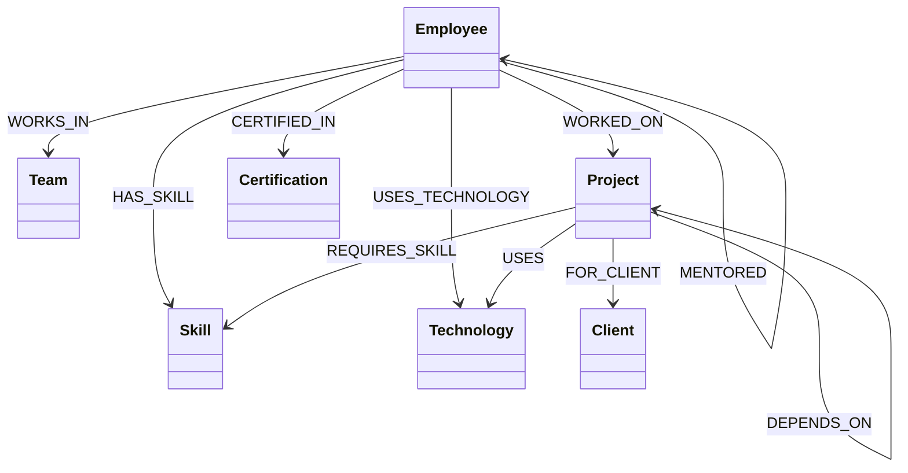

# TeamGraph — Relationship Intelligence Platform

TeamGraph is an organizational relationship intelligence application built around a graph database. It maps and visualizes how people, teams, projects, skills, technologies, clients, and certifications connect across an enterprise.

---

## 1. Overview

In large organizations, information is typically trapped in departmental silos: HR directories, project management tables, skill surveys, and training registries. TeamGraph breaks down these silos by uniting organizational data into a single, cohesive **Knowledge Graph**. By focusing on relationships rather than tabular rows, TeamGraph allows leaders to discover knowledge coverage, identify collaboration bottlenecks, track mentorship networks, and audit client exposure in real time.

---

## 2. Assessment Alignment

This project satisfies all requirements for the Wexa AI Candidate Take-Home Assignment.

| Assessment Requirement | Exact Requirement | Current TeamGraph Implementation | Evidence/File | Status |
| :--- | :--- | :--- | :--- | :--- |
| **Graph Data Model** | Labeled nodes, typed relationships, and properties documented in the README. | 7 Node types (`Employee`, `Team`, `Project`, `Skill`, `Technology`, `Client`, `Certification`) and 11 relationship types. | [seed/index.ts](file:///server/seed/index.ts) | **COMPLETE** |
| **Seed Data Script** | Real/realistic seed data loaded by a script included in the repo. | Idempotent `run-seed.ts` script populates exactly 126 nodes and 512 relationships via parameterized MERGE. | [seed/run-seed.ts](file:///server/seed/run-seed.ts) | **COMPLETE** |
| **Cypher Queries** | Exercises the graph with a 2-hop or more traversal and queries a relational DB would find awkward. | `mostCollaborativeTeam` runs a 4-hop traversal mapping shared project assignments between teams. | [queries/insights.ts](file:///server/queries/insights.ts#L52-L60) | **COMPLETE** |
| **Parameterized Queries** | Parameterized queries via official Neo4j driver. No string concatenation. | All query parameters are passed in a variables block via the `neo4j-driver` transaction wrapper. | [cognodb/session.ts](file:///server/cognodb/session.ts) | **COMPLETE** |
| **Functional Web App** | Web application that non-technical users can use to explore. | A React dashboard, directories, search, and graph canvas for interactive exploration. | [src/App.jsx](file:///src/App.jsx) | **COMPLETE** |
| **Clean UI/UX** | Sensible layout, loading/empty states, typography, styling. | Tailored typography, sidebar layout, skeletons, empty states, and theme switching. | [src/components/](file:///src/components/) | **COMPLETE** |
| **Credentials Security** | URI and password read from env variables; never committed. | Loaded from `.env` on startup; the file is registered in `.gitignore` and excluded from build assets. | [cognodb/config.ts](file:///server/cognodb/config.ts) | **COMPLETE** |
| **Layered Architecture** | Clear project structure and codebase suitable for a line-by-line walk-through. | Structured layer design: Cypher Queries $\rightarrow$ Repository $\rightarrow$ Services $\rightarrow$ API $\rightarrow$ Client. | [server/README.md](file:///server/README.md) | **COMPLETE** |
| **Graceful Error Handling** | Error handling when database is unreachable. | Health-check probes boot configuration and displays user-friendly recovery screens when down. | [cognodb/health.ts](file:///server/cognodb/health.ts) | **COMPLETE** |

---

## 3. Problem Statement

Large enterprises struggle to understand their internal capabilities. Traditional tools use relational databases to store employee directories and project assignments. However, answering complex relational questions (e.g., *"Which teams are at risk because they rely on a single employee with a rare skill who is also working on a high-risk project for a key client?"*) requires joining 6 or more tables. As data grows, these queries become slow, difficult to write, and expensive to maintain.

---

## 4. Solution

TeamGraph solves this problem by representing the organization as a graph. Employees, skills, projects, and clients are **nodes**, and their interactions are **edges**. Because graph databases traverse edges natively rather than computing table joins, TeamGraph makes multi-hop relationship queries natural to express and efficient to execute, giving leaders a clear picture of organizational capability and operational risk.

---

## 5. Why a Graph Database?

A graph database is uniquely suited for organizational intelligence because:
1. **Dynamic Path Traversals**: Querying reporting lines (`REPORTS_TO`) or mentorship networks (`MENTORED`) to find chain lengths or skip-level managers is simple in Cypher (`-[:REPORTS_TO*1..4]->`) but requires recursive self-joins in SQL.
2. **Contextual Connections**: Relationships like `WORKS_IN`, `WORKED_ON`, and `HAS_SKILL` form a multi-dimensional matrix. In a graph, finding developers who know a technology and are on the same team is a simple pattern match.
3. **Flexible Relationship Model**: Adding new connections (e.g. tracking certifications) doesn't require modifying database schemas or running complex table migrations; new edges are simply drawn.

---

## 6. Graph Model

The canonical graph model maps the following node labels and relationship types:



### Nodes & Properties:
- **Employee**: `id`, `name`, `initials`, `role`, `seniority`, `department`, `location`, `email`, `experienceYears`, `joinedAt`
- **Team**: `id`, `name`, `department`, `focus`
- **Project**: `id`, `name`, `code`, `summary`, `status`, `risk`, `progress`, `startedAt`, `targetAt`
- **Skill**: `id`, `name`, `category`, `rarity`
- **Technology**: `id`, `name`, `category`, `adoption`
- **Client**: `id`, `name`, `industry`, `region`, `since`, `health`
- **Certification**: `id`, `name`, `issuer`

---

## 7. Architecture

The application is built with a decoupled client/server architecture that strictly isolates database credentials and driver code from the browser bundle:

```mermaid
graph TD
    subgraph Browser (Client)
        UI[React UI] --> Router[React Router]
        Router --> Query[TanStack Query]
        Query --> RepoAdapter[Client Safe Repository Adapter]
    end
    
    subgraph Server (Vite Middleware)
        RepoAdapter -- HTTP POST /api/* --> APIMiddleware[API Router Middleware]
        APIMiddleware --> Services[Graph / Employee Services]
        Services --> Repo[CognoGraphRepository]
        Repo --> Driver[neo4j-driver]
    end
    
    subgraph Database
        Driver -- Bolt Protocol --> CognoDB[(CognoDB Cloud)]
    end
```

---

## 8. Core Features

- **Dashboard**: High-level organizational KPIs, collaboration stats, and live graph activity and organizational signals.
- **Organization Directory**: Interactive, searchable lists of employees, projects, teams, skills, technologies, and clients.
- **Entity Intelligence**: Profiles (e.g., Employee details, Project scopes) mapping connections, mentors, certifications, and surrounding sub-graphs.
- **Network Explorer**: Interactive SVG canvas displaying the node network topology. Selecting a node highlights its dependencies.
- **Insights**: Graph analysis identifying organization silos, rare skills, and project risk clusters.
- **Global Search**: Keyboard shortcut (`⌘K`) search bar querying node properties globally.
- **Authentication**: Route guard protection redirecting unauthenticated traffic to the secure login page.
- **Theme Management**: Dropdown switcher support for four color palettes: *Vercel* (Monochrome), *Amber Minimal* (Warm), *Violet Bloom* (Soft Violet), and *Mono* (Terminal green).

---

## 9. Graph Intelligence & Use Cases

- **Employee $\rightarrow$ Team**: Determines department distribution and headcounts.
- **Employee $\rightarrow$ Project**: Identifies developer allocations and resource bottlenecks.
- **Employee $\rightarrow$ Skill**: Highlights knowledge holders and subject matter experts.
- **Employee $\rightarrow$ Technology**: Audits practical technology competency.
- **Employee $\rightarrow$ manager / mentor**: Maps reporting hierachies and mentorship networks.
- **Project $\rightarrow$ Client**: Measures client delivery impact.
- **Project $\rightarrow$ Technology / Skill**: Audits technology stacks and required skills.
- **Project $\rightarrow$ Project**: Identifies delivery roadblocks in dependency chains.

---

## 10. CognoDB Integration

TeamGraph integrates with CognoDB Cloud over the secure **Bolt Protocol** using the official `neo4j-driver` library:
- **Parameterized Cypher**: Every single query utilizes parameter placeholders (e.g. `$query`, `$limit`, `$id`) to ensure there is zero risk of Cypher injection.
- **Schema Constraints**: The schema configuration bootstrap ([run-schema.ts](file:///server/seed/run-schema.ts)) establishes uniqueness constraints on all node IDs to guarantee data integrity.
- **Lookup Indexes**: Establishes schema indexes on frequently queried properties (e.g. employee names, project status, technology categories) to optimize lookup performance.

---

## 11. Current Dataset

The database is seeded with a realistic dataset of a fictional technology company. The current counts are:
- **45 Employees**
- **8 Teams**
- **16 Projects**
- **24 Skills**
- **14 Technologies**
- **7 Clients**
- **12 Certifications**
- **126 Total Nodes**
- **512 Relationships**

---

## 12. Network Explorer Visualization

The **Network Explorer** renders a filtered topology of the organization. Because rendering all 126 nodes and 512 edges at once would make the visualization unreadable, the `getGraph` method utilizes a configurable limit (defaulting to 34–40 nodes). This displays a clean, readable radial layout of the most connected nodes, while the Dashboard counters represent the full, unfiltered database state.

---

## 13. Dashboard Mock Data

Certain text delta stats (e.g. `+4 this month` and `+12.4%` next to employee and relationship cards) represent presentation-only trends and are clearly labeled as **(Demo Data)**. To guarantee absolute transparency and graph honesty, the historical Relationship Growth chart has been removed entirely from the dashboard, as the canonical schema does not contain time-series event logs. The dashboard only displays live relationship and topology metrics derived from CognoDB.

---

## 14. Theme Management

The theme engine supports dynamic accent switching:
- **Vercel**: High-contrast monochrome.
- **Amber Minimal**: Warm amber accents.
- **Violet Bloom**: Soft violet tones.
- **Mono**: Minimalist terminal style.

Adding a brand only requires appending its color variables in [src/themes.css](file:///src/themes.css) and registering it in [src/lib/theme/themes.ts](file:///src/lib/theme/themes.ts).

---

## 15. Security

- **Server-Side Connection**: Database URI and passwords are read by the backend services and never sent to the browser.
- **No Client Exports**: Webpack/Vite compilation excludes `neo4j-driver` and `CognoGraphRepository` from the client bundle.
- **API Boundary**: The browser communicates exclusively via JSON payloads on `/api/*` endpoints.

---

## 16. Setup

1. **Install Dependencies**:
   ```bash
   npm install
   ```

2. **Configure Environment**:
   Create a `.env` file in the root directory:
   ```bash
   COGNODB_URI=bolt+s://<instance-id>.databases.cognodb.cloud
   COGNODB_USERNAME=cognodb
   COGNODB_PASSWORD=<your-cognodb-password>
   ```

---

## 17. Database Schema & Data Setup

1. **Bootstrap constraints and indexes**:
   ```bash
   npx tsx --env-file=.env server/seed/run-schema.ts
   ```

2. **Load seed data**:
   ```bash
   npx tsx --env-file=.env server/seed/run-seed.ts
   ```
   *Note: Both scripts are completely idempotent.*

---

## 18. Verification & Local Dev

To launch local development:
```bash
npm run dev
```
Open [http://localhost:5173/](http://localhost:5173/) in your browser.

To verify code correctness:
- **Typecheck**: `npm run typecheck`
- **Build**: `npm run build`
- **Repository Integration Tests**: `npx tsx --env-file=.env server/seed/test-repository.ts`

---

## 19. Assessment Demo Flow

We recommend the following **5–10 minute demonstration sequence** for evaluation:

1. **Login**: Open [http://localhost:5173/](http://localhost:5173/). Notice the login guard redirection. Log in (mocked details automatically load).
2. **Dashboard**: Inspect the Relationship Intelligence metrics. Note that live database values match CognoDB, and the Graph Activity feed displays live connections in the graph, with no fabricated historical growth charts.
3. **Sidebar Navigation**: Browse through **Employees**, **Projects**, and **Teams**.
4. **Employee Profile**: Navigate to *Employees* $\rightarrow$ click on *Jessica Chen*. Note her skills, team, certs, reporting line, and surrounding sub-graph.
5. **Network Explorer**: Open **Network Explorer**. Search for a technology node (e.g. "Docker"). Inspect its properties and surrounding connections.
6. **Command Palette**: Press `⌘K` to open the search console. Search for "Sunil" or "synergy" and navigate to the entity page.
7. **Insights**: Browse **Insights** to view graph-driven analytics (e.g., most collaborative team, rare skills).
8. **Theme Customization**: Switch between *Vercel*, *Amber Minimal*, and *Mono* modes in the top bar.

---

## 20. Future Enhancements

- **Real-Time Adjacency Changes**: Add forms to add/modify relationships directly from the UI.
- **Graph Data Science**: Integrate Neo4j GDS library for Louvain community detection and page rank analysis.
- **Real Activity Logging**: Track relationship timestamps to feed a live historical growth chart natively.
